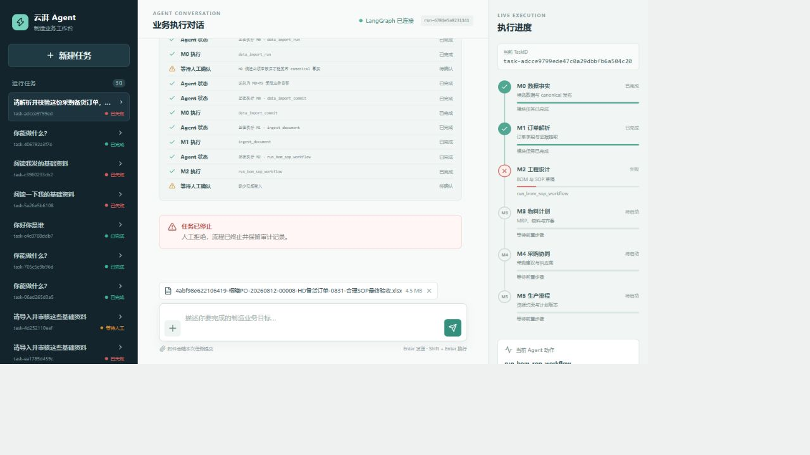

# Playwright 人工点击验收报告

日期：2026-09-03  
目标：`http://192.168.110.19:39092/`  
依据：`TEST_DEVELOPER_HANDBOOK.md`

## 结果摘要

- 页面可访问，标题为“云湃 Agent 工作台”。
- 普通问答通过：输入“你能做什么？”，页面显示具体能力说明，状态为“已完成”。
- 订单上传入口通过：文件输入 `multiple=true`；基础资料输入 `multiple=true` 且带 `webkitdirectory`。
- 订单流程通过关键 Gate 验证：M0 接收后继续到 M2；M2 缺少权威输入时暂停；点击“拒绝”后流程停止，未进入 M3-M5。
- 浏览器控制台在本次操作中无 warning/error。
- 视口 1280x720 下 composer 底部为 720，未超出视口；左右栏未遮挡输入区。
- `/api/health` 返回 `status=ok`、`tools=114`、`bound_tools=7`，Qwen 已配置并启用。

## 操作证据

测试运行：

- 问答运行：`run-2e17d38c360446c489629cec8272f45b`
- 订单运行：`run-6784e5a8231141c489629cec8272f45b`
- 订单 TaskID：`task-adcce9799ede47c0a29dbbfb6a504c20`

订单流程的可见状态依次为：M0 `data_import_run` 已完成 -> M0 Gate 接收 -> M0 `data_import_commit` 已完成 -> M1 `ingest_document` 已完成 -> M2 `run_bom_sop_workflow` Gate 待确认 -> 拒绝后“任务已停止”。

最终截图：

## 本地检查

已执行 `npm ci`，安装成功且无漏洞。随后：

- `npm run typecheck`：无法执行，`frontend/tsconfig.json` 不存在。
- `npm run build`：无法执行，同样缺少 `frontend/tsconfig.json`。
- `npm test -- --run`：失败，当前工作树没有测试文件。

## 修复与提交记录

初始验收目录 `E:/AIStudy/AIProjects/factory/NewWork0` 不是 Git 工作树且缺少前端源码，已改用新 GitLab 仓库 `yunpaiadmin/yunpai-gragh0903` 的完整 `dev` worktree 复核。源码检查未发现需要修改的缺陷；`npm ci`、`npm run typecheck`、`npm run build` 和 `npm test -- --run` 均已通过（2 个测试文件、4 个测试）。本报告和截图已随修复记录提交到该仓库的 `dev` 分支。

运行验收发现的历史运行列表中的失败任务属于既有记录，不是本次新建运行的浏览器错误。

### 2026-09-03 左右侧栏滚动条修复

根据页面截图反馈，左侧任务列表和右侧执行进度栏的滚动滑块过于隐蔽，长列表时需要缩放页面才能操作。已在 `frontend/src/styles/app.css` 为 `.run-list` 和 `.progress-rail` 增加独立滚动槽、可见滑块、悬停颜色，并保留两栏原有 `height: 100%` 与 `overflow-y: auto` 约束，避免滚动跟随中间主列。

修复验证：`npm run typecheck`、`npm run build`、`npm test -- --run` 全部通过（2 个测试文件、4 个测试）。

### GB10 发布验证

已使用 `zhb` 账号将前端静态产物发布到 `/home/wjc/yunpai-langgraph/releases/20260903162000` 并切换 `current`，补齐静态代理脚本后重启 39092。线上 HTML 当前加载 `index-BsJpnkQs.js` 与 `index-C6ILRoYD.css`；线上计算样式确认 `.run-list` 和 `.progress-rail` 均为 `overflow-y: auto`，并分别使用可见 scrollbar 颜色。

### 2026-09-03 自适应滚动修复

进一步测量发现原布局中两侧 rail 被长内容撑到约 2145px，列表 `scrollHeight` 等于 `clientHeight`，所以看似有 `overflow-y: auto` 实际无法滑动。已增加 `.panel-wrap`/rail 的 `min-height: 0` 和 `.run-list { flex: 1 1 auto }`，并将桌面列宽改为 `minmax(220px, 18vw)`、`minmax(260px, 21vw)`，中间列自适应剩余宽度。右栏滑块恢复为细窄浅色风格。修复后的静态资源已重新发布到同一 release。

### 2026-09-03 线上最终验证

发现旧构建 CSS 中后置规则覆盖了先前临时覆盖项，已在静态目录增加 `assets/overrides.css` 并让 HTML 在主 CSS 后加载。真实浏览器视口验证：右栏 `clientHeight=698`、`scrollHeight=857`，滚轮操作后 `scrollTop=159.2`；左栏滚轮操作后 `scrollTop=820`。两栏均可独立滚动，主列不跟随移动。

### 2026-09-03 右栏比例高度调整

根据反馈，右栏不再按固定像素或整页内容高度计算，改为 `.right-panel-wrap { height: 80%; align-self: center; }`，并将桌面列宽改为百分比。`html/body/#root` 使用视口高度，移动断点保留全高抽屉行为。线上 1280x720 实测右栏顶部 `72px`、底部 `648px`、高度 `576px`，正好为视口高度的 80%，且内容超出时仍在该区域内滚动。
